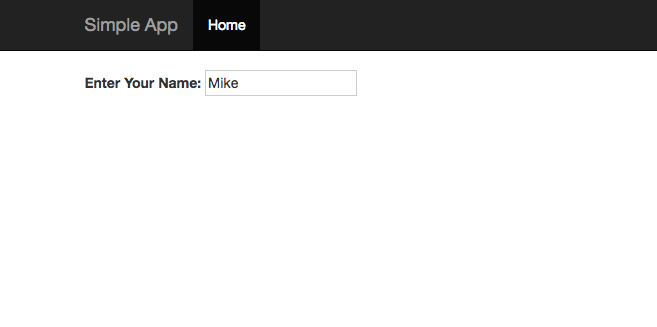
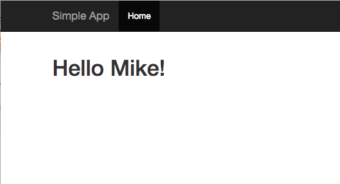

# Simple Flask App With Docker
------------------------------
A simple "Hello World!" type <a href="http://flask.pocoo.org/">Flask</a> app that uses <a href="https://getbootstrap.com/">Bootstrap</a>.

To use, download <a href="https://www.docker.com/">Docker</a> and then clone this repository. From the repo directory run:

	docker build -t simpleapp .

To run the app run:

	docker run -id -p 8080:8080 simpleapp

Then go to the site http://0.0.0.0:8080 to see the page:

When you put in a name and hit enter results in:

Deploying to [Google Cloud App Engine](https://cloud.google.com/appengine) run:

	gcloud app deploy

Then go to the `target url`.

